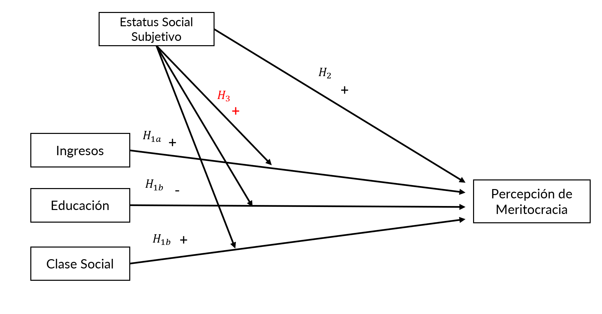
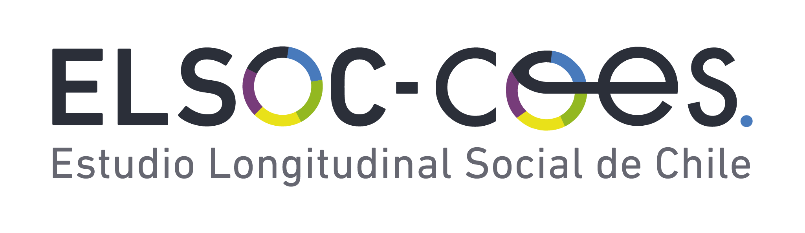
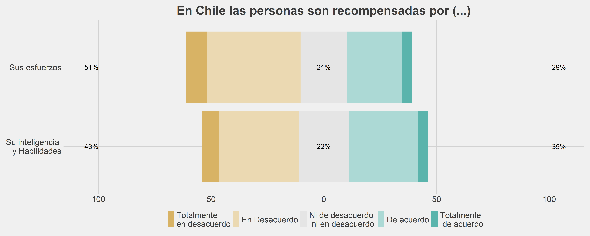
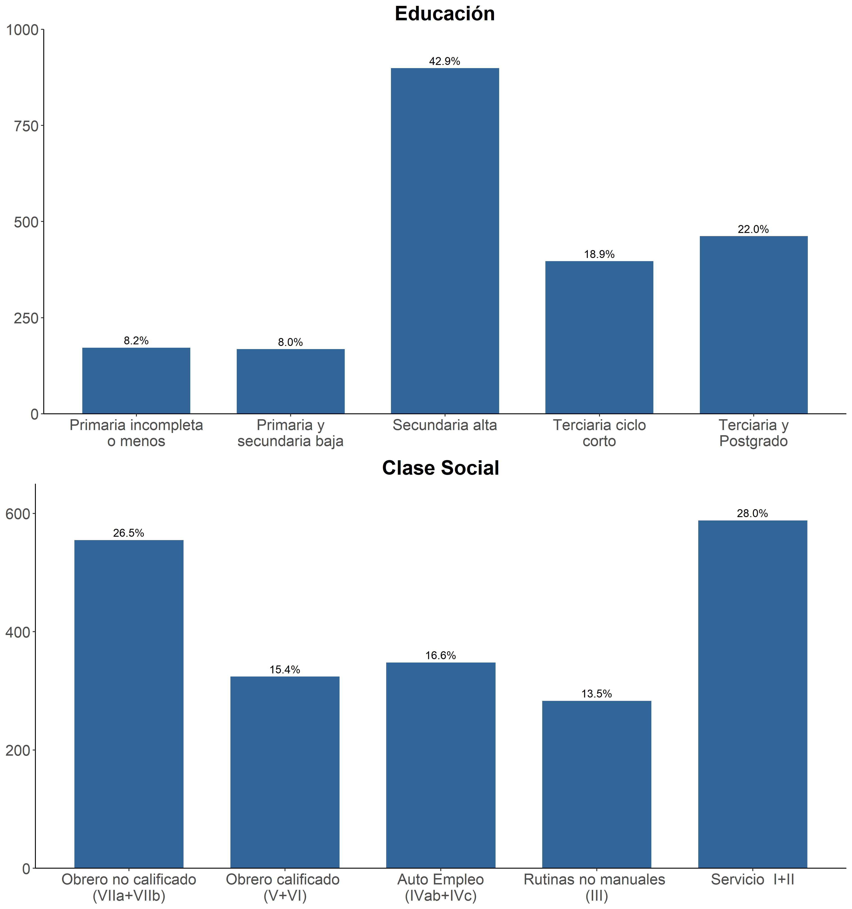
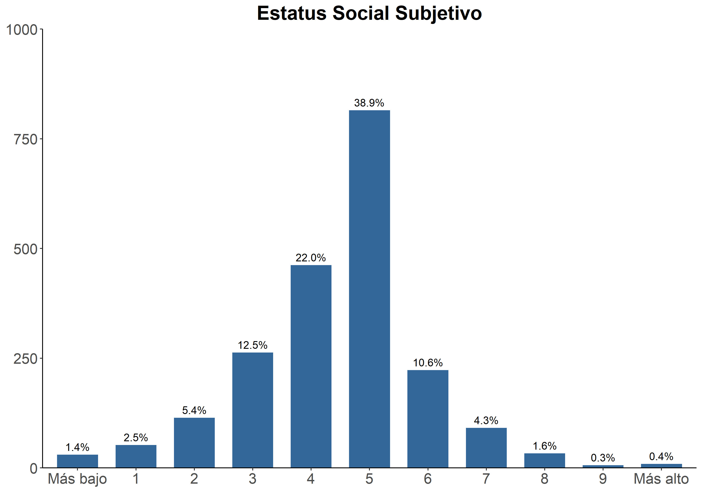
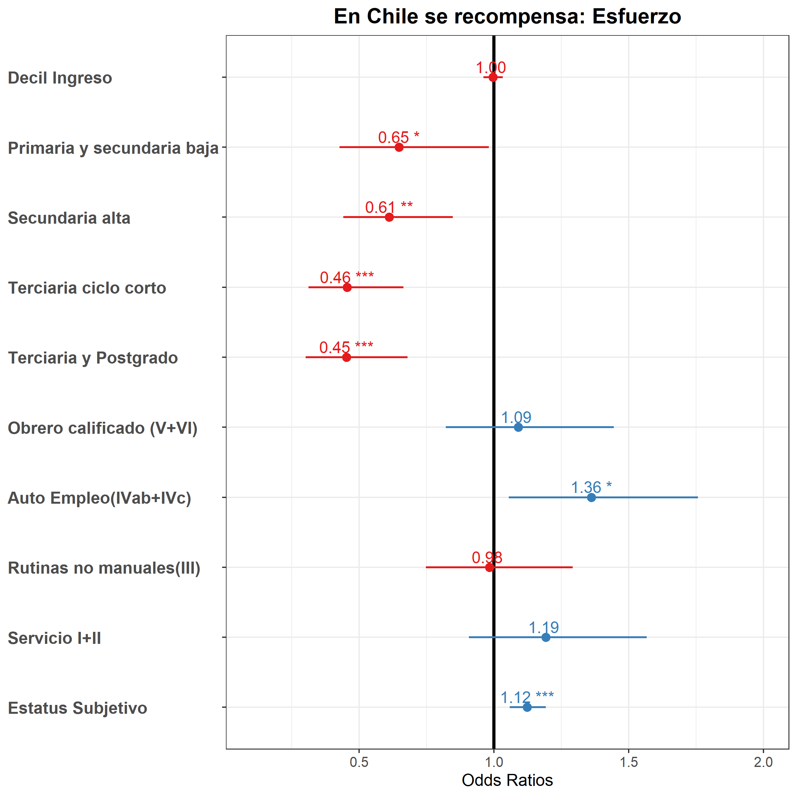
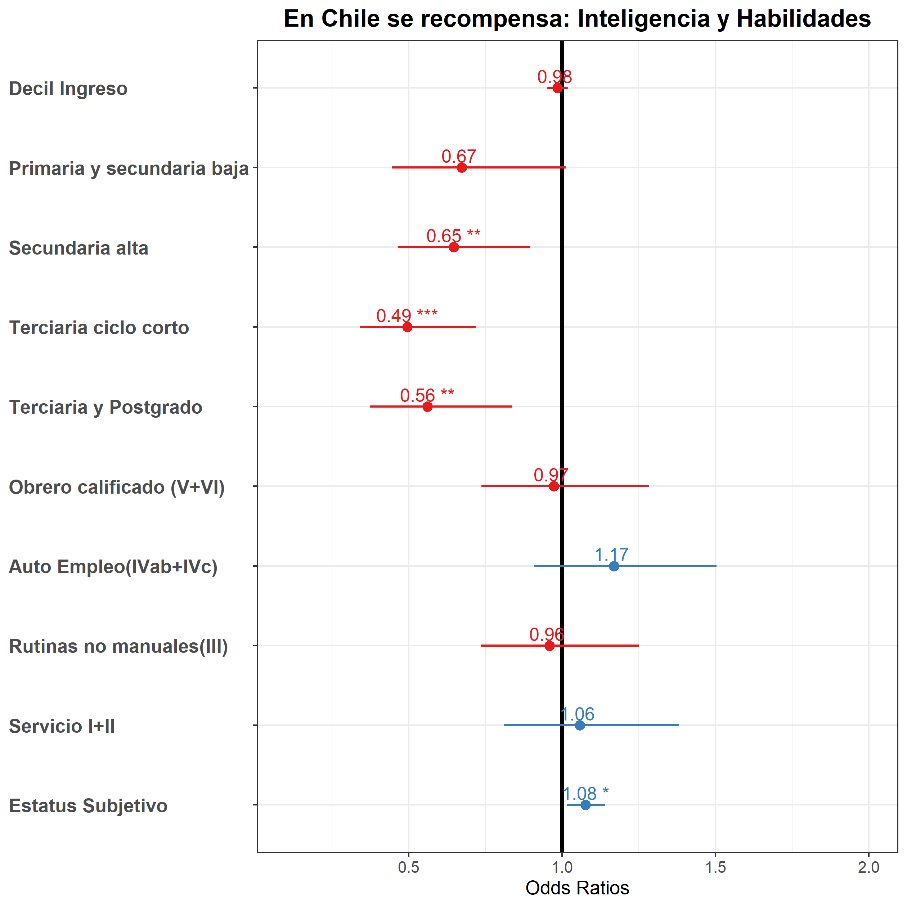

layout: true
class: animated, fadeIn

```{r setup, include=FALSE, cache = FALSE}
library(RefManageR)
bib <- ReadBib("tesis.bib", check = FALSE)
```


---
class: slideInRight
# Mérito y Meritocracia

### _The Rise of Meritocracy_ `r Cite(bib, c("Young1961"))`


* Idea de Mérito como la combinación de Esfuerzo y Talento.


### _Beliefs about Stratification_  `r Cite(bib, c("Smith1981"))`

* Creencias sobre las causas de la desigualdad social.

* Marco conceptual para el estudio estudio de la meritocracia desde el punto de vista subjetivo vinculado a la estructura social. 


### _Percepción de Meritocracia_ `r Cite(bib, c("Garcia2001"))`

* "(...) el grado en que los individuos consideran que su sociedad cumple con los principios de una meritocracia, es decir, que funciona como un sistema que asigna recompensas en función del esfuerzo y las habilidades".


---

## Relación entre Estatus social y Meritocracia

* **Hipótesis de Interés racional**: Mayores ingresos y pertenecer clases sociales más aventajadas se asocian con menores preferencias hacia la redistribución `r Cite(bib, c("Meltzer1981","Svallfors2006"))`.  

* **Hipótesis de instrucción**: Individuos más educados sostienen una visión crítica de la meritocracia en contextos de mayor desigualdad económica  `r Cite(bib, c("Duru-bellat2012"))`.

* _**Reality Blended Hypothesis**_ `r Cite(bib, c("Evans2004"))`: Formación de Estatus Social Subjetivo como resultado de la posición objetiva y procesos de comparación social con grupos de referencia `r Cite(bib, c("festinger1954theory"))`. 

* Se ha evidenciado que en Chile las **Preferencias y Percepciones** en la meritocracia son predichas negativamente con el nivel educacional y positivamente por el estatus social subjetivo `r Cite(bib, c("Castilloetal2019"))`. 

---

.center[
 

]

.small[
> Maldonado, L., Castillo, J. C., Iturra, J. C., Atria, J., & Meneses, F. (2019, November 3). Meritocracia y redistribución en Chile: señales de la opinión pública. https://doi.org/10.17605/OSF.IO/G4EK8
]

---
class:  middle

# _En el contexto chileno, ¿Cómo se relacionan las características objetivas y subjetivas de estatus social con la percepción de meritocracia?_

---

## Estatus social objetivo

$H_{1a}$: Una posición superior en la distribución de ingresos se asocia **positivamente con la percepción de meritocracia**.

$H_{1b}$: Pertenecer a grupos con mayor logro educativo, se asocia con una **menor percepción de meritocracia**.

$H_{1c}$: Pertenecer a clases sociales más aventajadas se asocia con una **mayor percepción de meritocracia.**

---

## Estatus social subjetivo

$H_{2}$: Individuos con un Estatus Social subjetivo más alto tenderían a percibir **más meritocracia**. 

## Posición objetiva $\times$ subjetiva

$H_{3}$: El efecto del estatus objetivo (ingreso, educación y clase social) sobre la percepción de meritocracia es **moderado positivamente** por el estatus social subjetivo.

---
class: center, middle 
 

---
class: center, middle, slideInRight

# Datos
---

class: middle
### Encuesta Social Longitudinal de Chile (ELSOC) para el año 2018.

```{r echo=FALSE,out.width='80%', fig.align='center'}

```

### Representatividad nacional, con un muestreo probabilístico, estratificado, por conglomerados y multietápico, con un total de 3748 participantes con edad entre 18 y 75 años (Mujeres =1446).


---
class: middle, center
# Descriptivos 

---
# Percepción de Meritocracia .tiny[ ( _p_ = 0.76 )]

.center[



#### Muestra analítica final: 2098 casos (excluye individuos sin ingresos y fuera del mercado laboral)  

]


---
class: middle


.left-column[

```{r echo=FALSE,results='asis'}
load(file = "images/tab01.RData")
print(tab01)
```

 


]


.right-column[

###### _En nuestra sociedad, hay grupos que tienden a ubicarse en los niveles más altos y grupos que tienden a ubicarse en los niveles más bajos de la sociedad. Usando la escala presentada, donde 0 es el nivel más bajo y 10 el nivel más alto, ¿Dónde se ubicaría usted en la sociedad chilena?_

 
]


---


#### Regresión logística ordinal


Se estima la probabilidad de que $Y$ sea igual o menor a una categoría de la escala ordenada. Existe una probabilidad estimada para cada categoría de respuesta $j$. Esta **probabilidad acumulada** es representada por:
  
  $$P(Y \le j) = \pi_1 + ... \pi_j, j=1,...J $$
Donde la función de enlace y predictor lineal son:

$$\log\bigg[ \, \frac{P(Y \le j)}{1 - P(Y \le j)} \bigg]\, = \alpha_j + \beta_x, j=1,...,J-1$$
  
#### Recodificación de escala (Likert de 5 puntos) 
  1. **Muy en desacuerdo + En desacuerdo** 
  2. **Ni de acuerdo ni en desacuerdo**  
  3. **Muy de acuerdo + En desacuerdo** 
  
---
class: center, middle, inverse, slideInRight

# Resultados Modelos de Regresión

---
class: 

.left-column[



]

.right-column[


]

.right[
.small[_**Nota**_: Se incluyen controles para sexo, edad y posición política]
]

---
class: middle, center, slideInRight
# Interacciones 

---
background-image: url(images/intef01.png) 
background-size: contain

---
background-image: url(images/inttal01.png)
background-size: contain


---
### Ingresos, Educación y Clase Social

* La ausencia de asociación con los ingresos muestra que un enfoque de interés racional  $(H_{1a})$ no es suficiente para explicar la percepción de meritocracia.

* Conforme a la hipótesis de instrucción $(H_{1b})$, individuos con mayor educación perciben ser menos recompensados por su esfuerzo y habilidades. 

* Pertenecer a una clase social más aventajada $(H_{1c})$  no se vincula con una mayor percepción de meritocracia.

* La interacciones objetivo $\times$ subjetivo ofrecen más información.

---
### Estatus Social subjetivo

* Individuos que se **perciben más alto** en la jerarquía social son quienes perciben mayor meritocracia $(H_2)$ .      

* El estatus social subjetivo $(H_3)$ muestra ser relevante en moderar el efecto de la posición objetiva sobre la percepción de meritocracia. 

_**Esfuerzo**_ - aumenta la probabilidad de estar "De acuerdo" en:

  + Individuos de ingresos altos.
  + Alta educación: Terciaria y Postgrado.
  + Individuos pertenecientes a las clases de trabajo no manual (Servicios y Rutina).

_**Inteligencia y habilidades**_ - mayor probabilidad  "De acuerdo" en:
  + Individuos de ingresos altos.
  + Alta educación: Terciaria, Superior y Postgrado.
  + Individuos pertenecientes a la clase de servicios. 


---
.small[

```{r, results='asis', echo=FALSE}
PrintBibliography(bib)
```

]

---
class:middle, center

# Gracias
## julioiturrasanhueza@gmail.com

---
class: center, middle

## Estatus social subjetivo, posición objetiva y percepción de  meritocracia: una aproximación empírica al caso de Chile.

---
class: center, middle

Slides created via the R package [**xaringan**](https://github.com/yihui/xaringan).

The chakra comes from [remark.js](https://remarkjs.com), [**knitr**](http://yihui.name/knitr), and [R Markdown](https://rmarkdown.rstudio.com).


