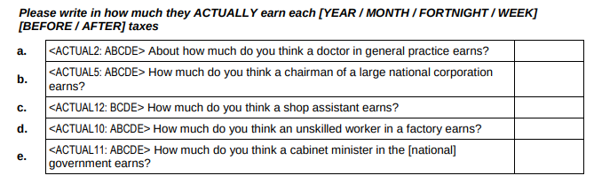

class: middle hide-logo title

```{r xaringanExtra, echo = FALSE}
  xaringanExtra::use_progress_bar(color = "red", location = c("top"))
```

.pull-left-narrow[
.espaciosimple[
.tiny[]
]
<br>
<br>
<br>
<br>
<br>
<br>


<br>


]


.pull-right-wide[
.right[

.content-box-gray[

# Percepción de desigualdad y brechas de género en Chile
]

----
.espaciosimplelineas[
.medium[
Juan C. Castillo - Universidad de Chile 

[jc-castillo.com](https://jc-castillo.com/)

] 
]


.small[Santiago, P. Universidad Católica de Chile

Octubre 24, 2024 

]

]
]

---
class: roja bottom

## **1. Percepción y brechas**
## 2. Brechas percibidas por género


---
class: middle center
<br>

.left[.tiny[Castillo, 2012]]

---
class: center


.left[.tiny[Castillo et al, 2012]]
---


---
class: middle center


.left[.tiny[Castillo, 2012]]

---
class: middle center

.left[.tiny[Castillo, 2012]]


---
class: middle center

.left[.tiny[Castillo, Meneses, Iturra & Maldonado (2019)]]


---
class: middle center 

.left[.tiny[Castillo, Meneses, Iturra & Maldonado 2019]]


---
class: middle center

## Código & datos análisis 1999-2019:

# [https://github.com/justicia-distributiva/chile-ISSP-gaps-1999-2019](https://github.com/justicia-distributiva/chile-ISSP-gaps-1999-2019)


---
class: middle center
<br>

.left[.tiny[Castillo, 2009]]


---
class: inverse

## .red[Ideas centrales]

- relevancia de percepción de desigualdad en relación a justificación y preferencias redistributivas

- otras medidas de percepción de desigualdad (ej, vida cotidiana García-Castro, 2020, 2021)

- corrección de sesgos vía presentación de información objetiva (Iturra et al, 2022)

- desigualdad vs concentración de ingresos

---
class: center middle
## Más información

.center[

]

[doi.org/10.1080/02134748.2021.2009275](https://doi.org/10.1080/02134748.2021.2009275
)


---
class: roja bottom

## 1. Percepción y brechas
## **2. Brechas percibidas por género**

---
class: middle center


???
1- we are all aware of the existence and persistence of gender pay gaps

2- this is a worldwide phenomenon with large variance between countries, but that in OECD average is about 12 percent

3- most of the research in this area is related to sociostructural factors, but we know little about the extent to which this problem is 1) perceived by the population, 2) if this is something considered unjust or not. 

4- awareness of this problem, specially from the side of women is relevant given that if this situation is misperceived it is difficult to expect reduction of the gender pay gap

---
class: middle


## Investigaciones recientes


- Auspurg, Hinz & Sauer (2017), vignette experiment, respaldan la teoría de la expectativa de recompensas: los hombres y las mujeres justifican salarios más bajos para las mujeres

- Sauer (2020): sesgo de evaluación de pago de género en población general pero no en estudiantes universitarios

---
class: middle
.pull-left-narrow[
## Este estudio]

.pull-right-wide[
.content-box-red[
- _¿En qué medida las brechas salariales de género son .red[percibidas] y .red[justificadas]?_

- Hipótesis de expectativa de recompensas: Hombres y mujeres justifican salarios más bajos para las mujeres

- Sesgo de percepción/hipótesis de comparación del mismo grupo: las mujeres perciben y justifican salarios más bajos, en particular para las mujeres
]
]
---
## Enfoques metodológicos


### 1. .gray[Diferencias entre hombres y mujeres en la percepción y justificación de los salarios (en general)]

### 2. .gray[Diferencias entre hombres y mujeres en la percepción y justificación de los salarios .red[para hombres y mujeres]]


---
## Instrumentos de encuestas

.pull-right-wide[
### - .black[Preguntas sobre salarios percibidos y justos para diferentes ocupaciones] (ISSP)

### - Brechas salariales: .black[ratios entre salarios de ocupaciones de alto y bajo estatus] 
]

---
## Datos & variables

- ISSP Módulo de desigualdad social Chile 1999 (N=1,503); 2009 (N=1,505), & 2019 (N=1,374)

- Variables:
  - salarios percibidos
  - brecha salarial percibida (gerente/asistente de tienda)
  - salarios justos
  - brecha salarial justa (gerente/asistente de tienda)
  
---
class: center 



---
class: middle 

.pull-left-narrow[
## Salarios percibidos
]
.pull-right-wide[
]

---
class: middle

.pull-left-narrow[
## Salarios justos
]

.pull-right-wide[

]

---
class: middle

.pull-left[
### Brecha percibida
]

.pull-right[
### Brecha justa
]
---
class: middle

.pull-left-narrow[
## Brechas

(gerente/trabajador)
]

.pull-right-wide[

]
---
class: middle center


---

class: middle center


---
class: inverse

## Discusión

- Desigualdad vs percepción de desigualdad

- Sesgos y legitimación

- Mujeres perciben menos desigualdad salarial


---
class: roja middle center

# Gracias por su atención!


---
class: middle hide-logo title

.pull-left-narrow[
.espaciosimple[
.tiny[]
]
<br>
<br>
<br>
<br>
<br>
<br>


<br>


]


.pull-right-wide[
.right[

.content-box-gray[

# Percepción de desigualdad y brechas de género en Chile
]

----
.espaciosimplelineas[
.medium[
Juan C. Castillo - Universidad de Chile 

[jc-castillo.com](https://jc-castillo.com/)

] 
]


.small[Santiago, P. Universidad Católica de Chile

Octubre 24, 2024 

]

]
]

