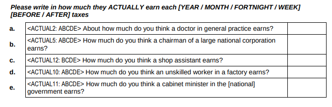
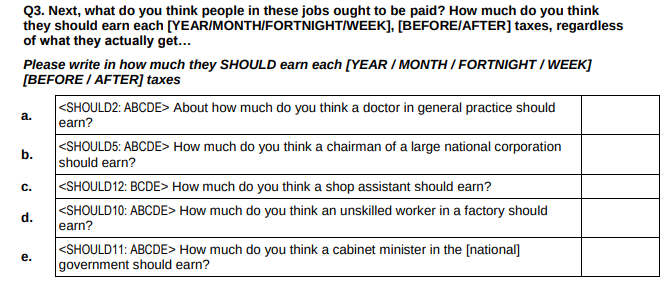
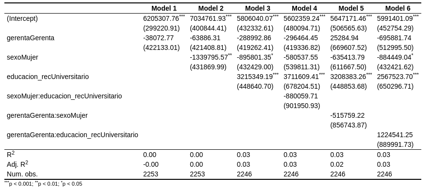
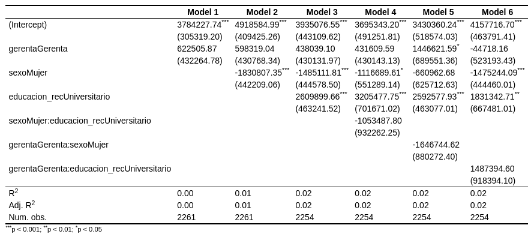

class:  title-slide

```{r xaringanExtra, echo = FALSE}
  xaringanExtra::use_progress_bar(color = "red", location = c("top"))
```


```{r xaringan-tile-view, echo=FALSE}
xaringanExtra::use_tile_view()
```


.pull-left-narrow[
.content-box-red[

<br>
<br>
<br>
<br>
<br>
<br>
<br>


.small[
European Survey Research Association Conference

Milan, July 17-19 2023

]
]
]
.pull-right-wide[
<br>

.right[

## Perceived salary and gender gaps in survey research
]


----

.right[
.medium[
<div style="line-height:150%;">
Juan Carlos Castillo *
<br> Kevin Carrasco & Julio Iturra <br>
</div>

]
<br>
.small[
<div style="line-height:150%;">
*Department of Sociology, Universidad de Chile
</div>
NUDOS - Digital Oportunities and Inequalities Milenium Project

[juancastillov@uchile.cl](juancastillov@uchile.cl) - [jc-castillo.com](https://jc-castillo.com)

]
]
]


---
class: roja bottom

# Context & motivation


---
class: middle center


???
1- we are all aware of the existence and persistence of gender pay gaps

2- this is a worldwide phenomenon with large variance between countries, but that in OECD average is about 12 percent

3- most of the research in this area is related to sociostructural factors, but we know little about the extent to which this problem is 1) perceived by the population, 2) if this is something considered unjust or not. 

4- awareness of this problem, specially from the side of women is relevant given that if this situation is misperceived it is difficult to expect reduction of the gender pay gap

---
class: middle

.pull-left-narrow[

## Recent research

]


.pull-right-wide[

- Auspurg, Hinz & Sauer (2017), vignette experiment, supports rewards expectation theory: men and women consider just lower pay for women

- Sauer (2020): gender payment evaluation bias in general population but not in university students 
]
---
class: middle
.pull-left-narrow[
## This research]

.pull-right-wide[
.content-box-red[
- _To what extent gender pay gaps are .red[perceived] and .red[justified]?_

- Rewards expectation hypothesis: men and women justify lower salaries for women

- Perceptual bias/same group comparison hypothesis: women perceive and justify lower salaries, particularly for women
]
]
---
.pull-left-narrow[## Methodological approaches]

.pull-right-wide[

### 1. .gray[Differences between men and women in the perception and justification of salaries (in general)]

### 2. .gray[Differences between men and women in the perception and justification of salaries .red[for men and women]]
]

---
## Survey instruments

.pull-right-wide[
### - .black[Questions about perceived and just salaries for different occupations] (ISSP)

### - Salary gaps: .black[ratios between salaries of high and low status occupations ] 
]
---
class: roja bottom right

# Study 1: 
## .orange[Perceived and justifyed salaries & gaps by gender]
## ISSP Chile 1999,2009 & 2019

---
## Data & variables

- ISSP Social Inequality module Chile 1999 (N=1,503); 2009 (N=1,505), & 2019 (N=1,374)

- Variables:
  - perceived salaries
  - perceived pay gap (chairman/shop assistant)
  - just salaries
  - just pay gap (chairman/shop assistant)
  
---
class: center 




---
class: middle 

.pull-left-narrow[
## Perceived salaries
]
.pull-right-wide[
]

---
class: middle

.pull-left-narrow[
## Just salaries
]

.pull-right-wide[

]

---
class: middle

.pull-left[
### Perceived gap
]

.pull-right[
### Just gap
]
---
class: middle

.pull-left-narrow[
## Gaps

(manager/worker)
]

.pull-right-wide[

]
---
class: middle center


---

class: middle center


---
class: roja bottom right

###Is there a difference when you ask specifically about male and female occupations?
----

# Study 2: 
## .orange[Perceived and Justifyed gender salary gaps - by gender]
### .black[Desiguales survey Chile 2017]

---
## Data 

- Desiguales survey - UNDP Chile 2017 (N=2,613, 18<)
- https://www.estudiospnud.cl/bases-de-datos/desigualdades-economicas-y-sociales-desiguales-2016/

## Variables
- perceived and just salaries for different occupations:

  - randomized block 1: cashier-F, doctor-M, deputy-F, chairman-M
  - randomized block 2: cashier-M, doctor-F, deputy-M, chairman-F


---
class: middle center


---
class: middle center


---
## Perceived salary: manager


---
## Just salary: manager


---
class: roja

# Discussion

- perceived and just gaps by gender: women perceive and justify lower salaries and gaps (same-gender referent theory?)

- no evidence so far for the gender of the occupation  

- limitation: fixed blocks for occupational gender in study 2; pay gaps not possible

- further research: longitudinal survey alternating the gender of the occupations 
  -  OSF-preregistration [.yellow[osf.io/9aewg]](https://)


---
class: roja middle

# ¡Muchas gracias!

<br>


.right[
###More information:

Github repo: [.yellow[github.com/justicia-distributiva/brechas-genero]](https://github.com/justicia-distributiva/brechas-genero)

Contact: juancastillov@uchile.cl - [.yellow[jc-castillo.com]](https://jc-castillo.com)
]

