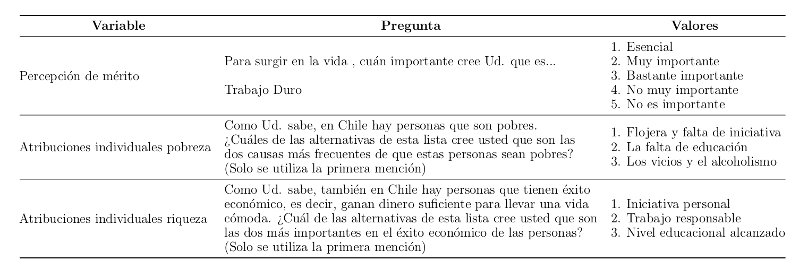
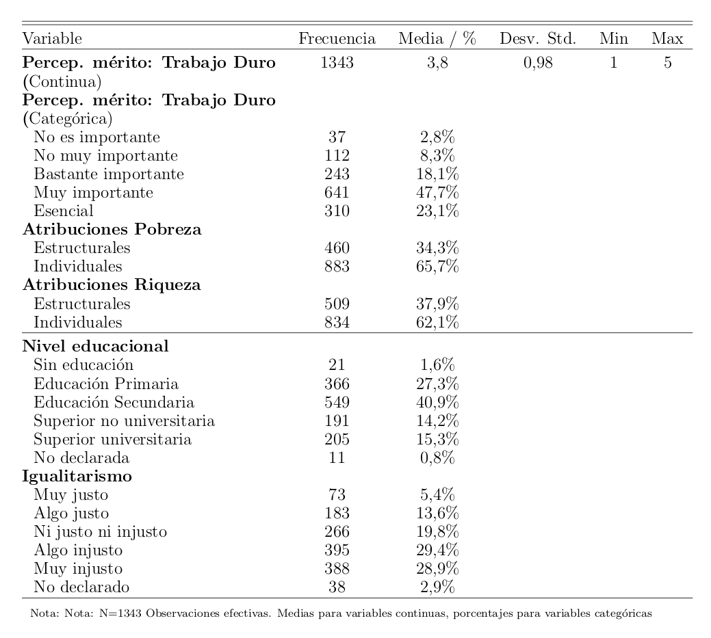
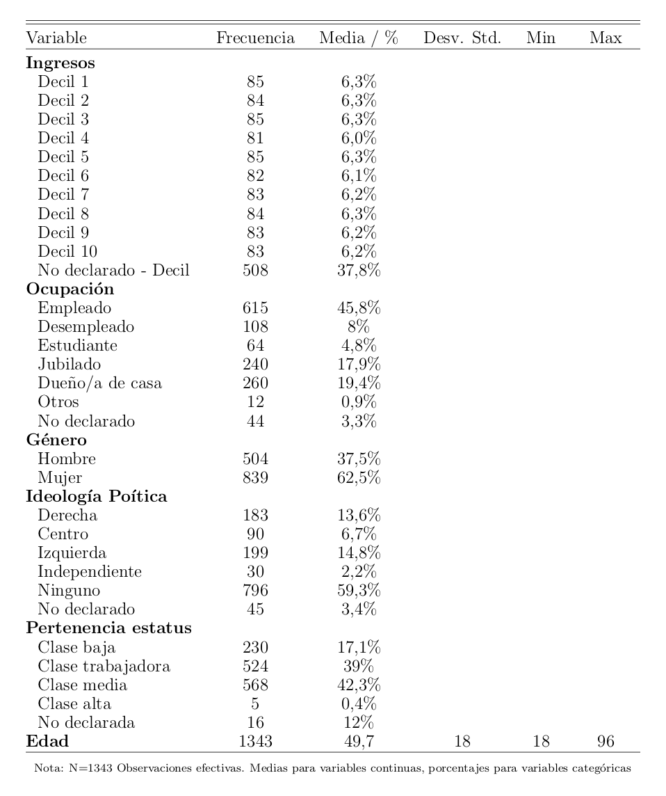
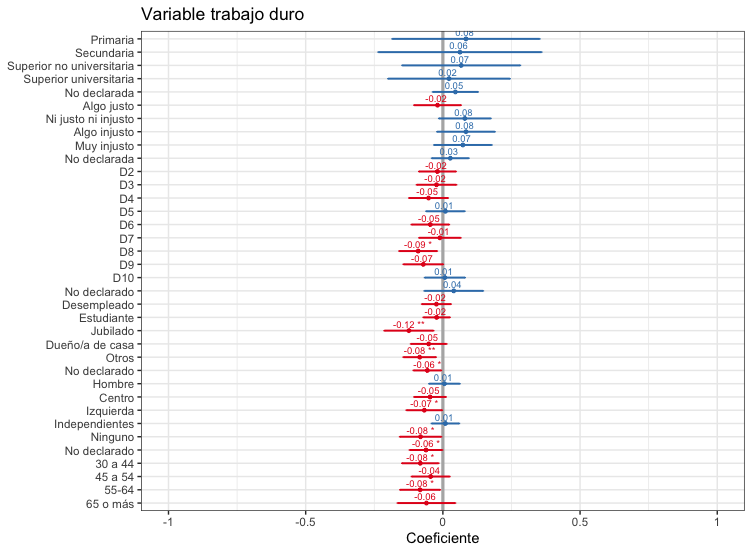
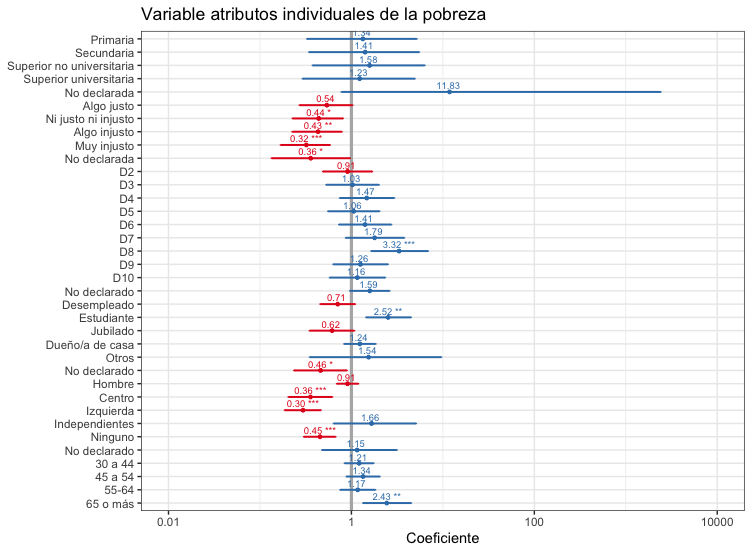
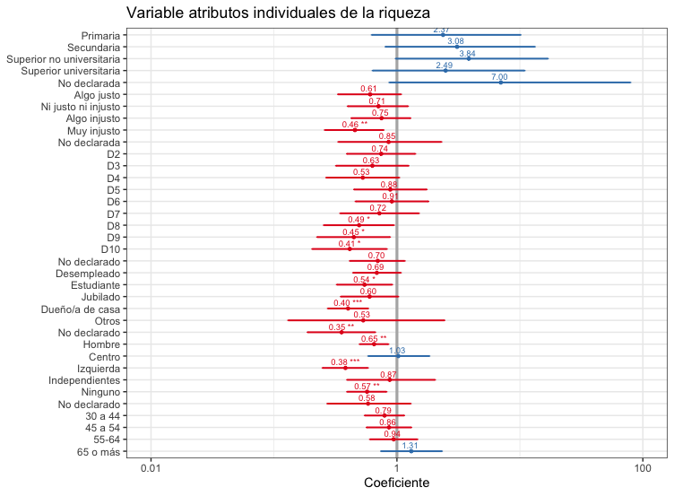
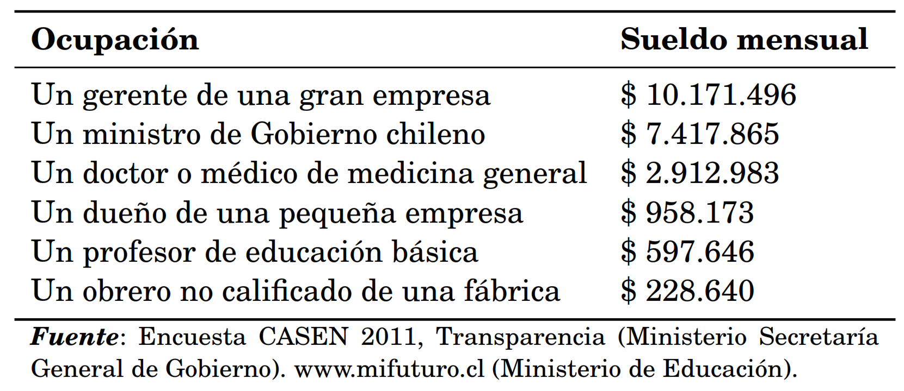
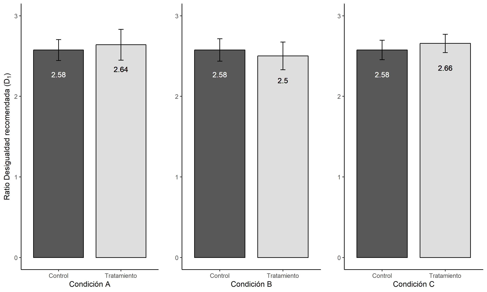
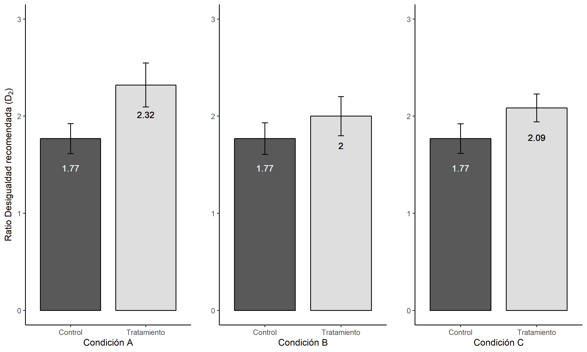

class: inverse, center, middle

# Meritocracia y Redistribución en América Latina

***
[FONDECYT N°1160921 - Lima 2019](https://www.researchgate.net/project/The-moral-economy-of-meritocracy-and-redistributive-preferences)

---
class: inverse, bottom, right

```{r setup, include=FALSE, cache = FALSE}
require("knitr")
options(htmltools.dir.version = FALSE)
pacman::p_load(RefManageR)
bib <- ReadBib("meritocracy.bib", check = FALSE)
```

```{r eval=FALSE, echo=FALSE}
# Correr esta linea para ejecutar
rmarkdown::render('ispp2019lisboa.Rmd', 'xaringan::moon_reader')
```


<!---
About macros.js: permite escalar las imágenes como [:scale 50%](path to image), hay si que grabar ese archivo js en el directorio.
--->

# Conocimiento sobre desigualdad y pobreza: ¿Influye en la percepción de oportunidades y meritocracia?
## * Un experimento de encuesta *
<br>
<hr>
### Luis Maldonado, _Pontificia Universidad Católica de Chile_ - lmaldona@uc.cl
### Juan Carlos Castillo, _Universidad de Chile & COES_
### (Leslie McCall, _Stone Center of Economic Inequality_)
### Julio Iturra & Francisco Meneses 

<br>

.small[FONDECYT N°1160921 - Lima 2019]

---

layout: true
class: animated, fadeIn

---

class: roja, middle, center, slideInRight

# Antecedentes

---
## Contexto de investigación

- FONDECYT grant 1160921: **La economía moral de la meritocracia y las preferencias redistributivas** (Juan Castillo, Luis Maldonado & Jorge Atria)


--

  - 2016-2020

  - Estudios cualitativos (entrevistas y grupos focales)

  - Análisis de datos secundarios (ISSP)

  - Encuesta de experimentos

--

- Más información y actualizaciones en el sitio web de nuestro proyecto en Researchgate: [https://www.researchgate.net/project/The-moral-economy-of-meritocracy-and-redistributive-preferences](https://www.researchgate.net/project/The-moral-economy-of-meritocracy-and-redistributive-preferences)

---
## Contexto del país

.center[]

.small[Fuente: OECD 2018 and PNUD 2017.]

---
## Contexto del país

.center[]

.small[Fuente: OECD 2018 and PNUD 2017.]

---
## Contexto del país

.center[]

.small[Fuente: WVS 1990-2012 and ISSP 2016.  La figura de la izquierda es el nivel de acuerdo con *Los ingresos deben hacerse más iguales* ; La figura de la derecha es la opción *Definitivamente debería ser responsabilidad del gobierno reducir las diferencias de ingresos entre los ricos y los pobres*] 
---
##  Contexto del país

.center[]

.small[Fuente: estudio piloto (no representativo de la población chilena). La pregunta es: *¿Cree que la cantidad de personas pobres en Chile hoy en día es mayor, menor o casi la misma que hace 20 años?* ]

---
class: roja, middle, center, slideInRight

# Este estudio

---
## Concepto principal: Meritocracia

- Asignación de recompensas según el esfuerzo personal y el talento `r Cite (bib, c (" young_rise_1962 "))`

-  Considerado como un "mito" que legitima la desigualdad en las sociedades modernas `r Cite (bib, c (" young_rise_1962 "," hadjar_meritokratie_2008 "," kunovich_systems_2007 "," mcnamee_meritocracy_2004 "," arrow_meritocracy_2000 "," @ mijs_parado_) _ )_)rrow_meritocracy_2000","@mijs_paradox_2019"))`

- Diferentes dimensiones meritocráticas `r Cite(bib, "castillo_meritocracia_2018")`

  -  **percepción** de meritocracia (descriptiva)

  -  **preferencias** para la meritocracia (normativa)

---
class: middle, center


---
class: middle, center


---
class: middle, center


---
class: middle, center


---
## `r Cite (bib, "mccall_Exposure_2017")`

- Información de desigualdad -> creencias de oportunidad (batería "get a head" GSS / ISSP)
  - Más peso para los factores estructurales (como familia adinerada)
  - Menos peso a factores individuales (como trabajo duro)


##  ... agregamos

- Tratamiento de la información sobre la pobreza.
- Elementos de oportunidad separados en lugar de factores estructurales e individuales.
- Ítem de educación.
- Verificación de conocimientos previos.

---
##  Objetivo e Hipotesis

-  ** Objetivo ** : Evaluar si la exposición a información objetiva sobre desigualdad económica y pobreza afecta las creencias de oportunidad

-  ** Hipótesis ** :

  - la información sobre la reducción de la pobreza refuerza el sueño meritocrático y, por lo tanto, lleva a creer más en factores individuales que estructurales.

  - la información sobre grandes desigualdades socava el sueño meritocrático y, por lo tanto, lleva a creer más en factores estructurales que individuales.

---
class: roja, middle, center, slideInRight

# Diseño de investigación

---
## Datos


1. _Nequest_ , una compañía de paneles en línea que trabaja en España, Portugal y América Latina   , recolectó una muestra de conveniencia para el estudio piloto en julio 2019 .

    -    N = 1,328 encuestados que viven en Santiago de Chile.

    -    Duración (mediana): 11 minutos.

    -    96% de los participantes terminan el cuestionario.

    -    La muestra efectiva tiene 794 encuestados.

    -    Usamos cuotas por género, educación y edad: 55% mujeres, 95% tiene secundaria o superior.

2.   Cuestionario y asignación aleatoria usando _Qualtrics_ .

---
##  Tratamientos

-    Tres condiciones

    1.   **Condición de pobreza** : Información sobre la evolución de la pobreza en Chile durante 1990-2015.

    2.   **Condición de control** : Información sobre el consumo de cigarrillos en Chile durante las últimas décadas.

    3.   **Condición de desigualdad** : Información sobre la desigualdad de ingresos en Chile en términos del índice 10/10 que muestra a Chile como uno de los países con mayor desigualdad de ingresos dentro de la OCDE.

- Diseñamos _comprobaciones de manipulación_ para cada una de estas tres condiciones.

---
###  1. Condición de pobreza: "Una serie de estudios muestran una disminución de la pobreza en Chile durante las últimas décadas ..."

.center[]

---
###  1. Condición de pobreza: "Una serie de estudios muestran una disminución de la pobreza en Chile durante las últimas décadas ..."

.center[]

---
###  2. Condición de control: "Una serie de estudios muestran una disminución en el consumo de cigarros en Chile durante las últimas décadas ..."

.center[]

---
###  3. Condición de desigualdad: "Una serie de estudios muestran que Chile presenta un alto nivel de desigualdad económica ..."

.center[]


---
##  Resultados y moderadores

-    Creencias de oportunidad (ISSP desigualdad social)

    -    ** Factores estructurales ** : a) provenir de una familia rica y b) tener padres bien educados.

    -    ** Factores individuales ** : c) trabajo duro y d) ambición.

    -    También e) tener una buena educación usted mismo.

-   Moderadores:

    -  **Igualitarismo** :"los ingresos deberían hacerse más iguales, aun cuando el esfuerzo individual no sea recompensado" (1), o "el esfuerzo individual debería ser recompensado a pesar de generar diferencias de ingresos" (10)

    -  **Percepción de la evolución de la pobreza** : mayor; lo mismo, disminuido.

---
##   Covariables y método

-    **Covariables** : características sociodemográficas.


-    **Métodos**

    -    Aleatorización: las covariables se equilibran entre las condiciones de tratamiento.

    - Las respuestas a los controles de manipulación están asociadas con variables sociodemográficas.

    -    Intent to treat effect (ITT) con regresiones para variables dependientes ordinales.

---
class: roja, middle, center, slideInRight

# Resultados

---
class: middle, center

<table cellspacing="0" align="center" style="border: none;">
<caption align="top" style="margin-bottom:0.3em;">Treatment effects: Ordinal logit, odds ratios</caption>
<tr>
<th style="text-align: left; border-top: 2px solid black; border-bottom: 1px solid black; padding-right: 12px;"><b></b></th>
<th style="text-align: left; border-top: 2px solid black; border-bottom: 1px solid black; padding-right: 12px;"><b>Family</b></th>
<th style="text-align: left; border-top: 2px solid black; border-bottom: 1px solid black; padding-right: 12px;"><b>Parent educ.</b></th>
<th style="text-align: left; border-top: 2px solid black; border-bottom: 1px solid black; padding-right: 12px;"><b>Education</b></th>
<th style="text-align: left; border-top: 2px solid black; border-bottom: 1px solid black; padding-right: 12px;"><b>Ambition</b></th>
<th style="text-align: left; border-top: 2px solid black; border-bottom: 1px solid black; padding-right: 12px;"><b>Hard work</b></th>
</tr>
<tr>
<td style="padding-right: 12px; border: none;">Poverty</td>
<td style="padding-right: 12px; border: none;">-0.98</td>
<td style="padding-right: 12px; border: none;">-0.91</td>
<td style="padding-right: 12px; border: none;">1.46<sup style="vertical-align: 0px;">**</sup></td>
<td style="padding-right: 12px; border: none;">1.16</td>
<td style="padding-right: 12px; border: none;">1.18</td>
</tr>
<tr>
<td style="padding-right: 12px; border: none;"></td>
<td style="padding-right: 12px; border: none;">(0.15)</td>
<td style="padding-right: 12px; border: none;">(0.14)</td>
<td style="padding-right: 12px; border: none;">(0.23)</td>
<td style="padding-right: 12px; border: none;">(0.18)</td>
<td style="padding-right: 12px; border: none;">(0.19)</td>
</tr>
<tr>
<td style="padding-right: 12px; border: none;">Inequality</td>
<td style="padding-right: 12px; border: none;">1.44<sup style="vertical-align: 0px;">**</sup></td>
<td style="padding-right: 12px; border: none;">1.15</td>
<td style="padding-right: 12px; border: none;">1.20</td>
<td style="padding-right: 12px; border: none;">1.04</td>
<td style="padding-right: 12px; border: none;">1.31<sup style="vertical-align: 0px;">*</sup></td>
</tr>
<tr>
<td style="padding-right: 12px; border: none;"></td>
<td style="padding-right: 12px; border: none;">(0.23)</td>
<td style="padding-right: 12px; border: none;">(0.18)</td>
<td style="padding-right: 12px; border: none;">(0.19)</td>
<td style="padding-right: 12px; border: none;">(0.16)</td>
<td style="padding-right: 12px; border: none;">(0.21)</td>
</tr>
<tr>
<td style="border-bottom: 2px solid black;">N</td>
<td style="border-bottom: 2px solid black;">794</td>
<td style="border-bottom: 2px solid black;">794</td>
<td style="border-bottom: 2px solid black;">794</td>
<td style="border-bottom: 2px solid black;">794</td>
<td style="border-bottom: 2px solid black;">794</td>
</tr>
<tr>
<td style="padding-right: 12px; border: none;" colspan="7"><span style="font-size:0.8em"><sup style="vertical-align: 0px;">***</sup>p &lt; 0.01, <sup style="vertical-align: 0px;">**</sup>p &lt; 0.05, <sup style="vertical-align: 0px;">*</sup>p &lt; 0.1</span></td>
</tr>
</table>
---
## El efecto de la condición de pobreza en **tener una buena educación usted mismo** por parte de los moderadores

.center[]


---
class: roja, middle, center, slideInRight

# Discusión

---
class: inverse, middle

-    Papel crítico de los contextos: aumentar las oportunidades económicas versus a una mayor desigualdad económica.

-    Efecto significativo de la información de pobreza sobre * tener un buen
    educación tu mismo *.

-    Modelo de oportunidad de creencias sobre desigualdad económica

    1.   **Pregunta abierta I** : el análisis descriptivo sugiere una demanda creciente de redistribución en un contexto de oportunidades económicas crecientes.

    2.   **Pregunta abierta II** : Mecanismos explicativos del efecto de las percepciones de la desigualdad económica en las creencias de oportunidad.


---
class: inverse

##  Etapa actual: diseño del estudio final

1.  ** Efecto de la información sobre desigualdad y pobreza en las creencias de oportunidad **

    -    Panel en línea utilizando Netquest con tres olas: a) primero para recopilar información previa al tratamiento (covariables y moderadores); b) tratamientos y resultados; c) seguimiento para evaluar la persistencia de los efectos.

    -    Incluir todos los elementos relevantes para medir las creencias de oportunidad.

    -    Moderación: igualitarismo y percepción del desarrollo de la pobreza.

2.   Registro del plan de preanálisis en OSF.

---
class: inverse
#  Referencias

.small[
```{r, results='asis', echo=FALSE}
PrintBibliography(bib)
```
]
---
class: inverse, center

##  ¿La información sobre desigualdad y pobreza influye en las creencias de oportunidad?
<hr>
### Luis Maldonado, _Pontificia Universidad Católica de Chile_ - lmaldona@uc.cl
### Juan Carlos Castillo, _Universidad de Chile & COES_
### (Leslie McCall, _Stone Center of Economic Inequality_)

### ... ... también con la contribución de nuestros asistentes de investigación Julio Iturra y Francisco Meneses

---
class: middle, right, inverse
# Educación, valores y percepciones sobre el mérito: Un mirada al caso chileno
***
## [José Daniel Conejeros $^{1,2}$]()
### $^{1}$ Centro de Estudios de Conflicto y Cohesión Social <br> $^2$ Pontificia Universidad Católica de Chile


---
# Introducción

**El mérito**

- Conjugación entre talento y esfuerzo (Young, 1958).

- Criterio de asignación de los sujetos a posiciones sociales (Yair en Ritzer, 2007)

**Percepciones sobre el mérito**

- Valorización del esfuerzo y el trabajo, junto a su respectiva recompensa monetaria y/o de movilidad social (Reynolds y Xian, 2014;  Roex, Huijts & Sieben, 2019; Mijs, 2019)

- Convicción generalizada en el valor del esfuerzo personal como criterio de cohesión en estructura social de posiciones asimétricas (McCoy & Major, 2007). 

- No es solo un principio de justificación y autovaloración, sino que se articula como una expectativa concreta con la que se evalúa la justicia en la sociedad (Sen, 2000; Araujo & Martuccelli, 2012).

---

# Introducción

**Educación y percepciones de mérito** 

.medium[+ _Educación e ideología_: el mérito como un horizonte normativo para la compresión del mundo y como pauta de acción (Bourdieu & Passeron, 1996). Creer en un mundo justo (Mijs, 2018). 

+ _Racionalidad del mérito_ (*self made man*): lo ganado por méritos propios (competencia en igualdad de condiciones). Apertura al mercado universitario en los 90 y la posibilidad de alcanzar puesto superiores sin importar las diferencias de origen (Dubet, 2011). 

+ _Contexto de socialización_: ambientes homogéneos pueden mantener a los individuos desconectados de fuentes de información  (Mijs, 2018). 

+ _Logro y margen de oportunidades_: En contextos universitarios habría mayores herramientas para comprender la sociedad, la experiencia de factores ajenos al mérito individual y el margen de oportunidades (Baer & Lambert, 1982; Goldthorpe,2003; Bucca, 2009; Araujo & Martuccelli, 2012). 
]
---

#Introducción 

**Creencias sobre equidad y percepciones de mérito** 

+ _Creencias igualitarias_: la creencia de un estatus de igualdad entre individuos, independiente el esfuerzo y el talento, puede conducir a una percepción menor de aspectos meritorios y a una mayor percepción de discriminación frente a desventajas personales y grupales (McCoy & Major, 2007). 

+ _Ideología desafiante_: en un contexto de inestabilidad, corrupción y problemas distributivos asociados, los ciudadanos adoptarían ideologías igualitaristas ya que esas creencias podrían servir para desafiar las formas injustas de distribución de la riqueza económica existente (Smith & Matějů, 2012)

---

# Problema de investigación

.medium[¿En qué medida el nivel educacional y las ideologías igualitarias se relaciona con las percepciones sobre el mérito para el contexto Chileno? 

**Objetivos**:

1. Identificar cómo se relaciona el nivel educacional alcanzado por los individuos con los niveles de mérito percibido para Chile. 

2. Detallar el grado de asociación entre el nivel de igualitarismo con las percepciones de mérito para el caso chileno. 

**Hipótesis**:

H1: Formar parte de grupos con mayor logro educativo (educación universitaria) estará asociado de forma negativa con el mérito percibido. 

H2: El nivel de igualitarismo de los individuos estará asociado de forma negativa con el mérito percibido. ]

---

# Datos, variables y método

**Datos:**

.medium[- Encuesta de Opinión Pública Nº83 que incluye el módulo sobre inequidad social de *Internation Social Survey Programmme* para el año 2019.

- Muestra representativa de la población chilena mayor de 18 años (urbana/rural). N=1380 observaciones.
]
**Variable Dependiente:**

<p align="center">



</p>

---

# Datos, variables y método

**Variables Independientes** 

+ *Educación*: Sin tomar en cuenta las repeticiones de curso, ¿cuál es su nivel educacional? [9 valores: Sin estudios - Estudios de postgrado]   

+ *Igualitarismo*: ¿Es justo o injusto, correcto o incorrecto, que las personas con ingresos más altos puedan pagar una mejor educación para sus hijos que las personas con ingresos más bajos? [Escala de 5 valores: Muy injusto, definitivamente incorrecto - Muy justo, definitivamente correcto]


**Método de análisis:**

+ Salir adelante: Análisis de regresión OLS ponderada.

+ Atribución pobreza/riqueza: Modelos de regresión logística binarias.

---

# Resultados: Descriptivos

<p align="center">



</p>

---

# Resultados: Descriptivos (continuación)

<p align="center">



</p>

---

# Resultados: Regresión OLS



---

# Resultados: Regresión Logística Binaria



---
class: center
# Resultados: Regresión Logística Binaria



---

# Conclusiones y discusión

- Los resultados muestran que el nivel educativo alcanzado no están asociado con percepciones sobre el mérito, sino que priman otros aspectos como mayores niveles de ingreso, ideologías igualitarias y políticas. 

- El igualitarismo actúa fuertemente en el contexto nacional a la hora de evaluar resultados sociales observados: riqueza / pobreza. Pero no de la misma manera a la hora de evaluar expectativas futuras.

- Mayores deciles de ingresos presentan mayor atribución a cuestiones estructurales a la hora de explicar el éxto económico, lo que no ocurre para evaluar la pobreza. 

---

# Futuras investigaciones

- Indagar la infuencia de espacios de socialización más específicos (familia y la escuela) en la construcción de ideas y marcos normativos meritocráticos cuando estos dispositivos están operando.

- Observar los (no)cambios que puden experimentar las percepciones sobre el mérito en contextos de crisis social. 

- Avanzar hacia un análisis empírico sobre el rol que estas percepciones meritocráticas pueden tener en la opinión pública, sobre todo en respaldo de políticas redistributivas. 


---
class: middle, right, inverse
# Riesgo y preferencias por redistribución
***
## [Matías Gómez $^{1,2}$]()
### $^{1}$ Centro de Estudios de Conflicto y Cohesión Social <br> $^2$ Pontificia Universidad Católica de Chile

---
class: inverse, right
# Desigualdad económica y su influencia sobre la percepción de diferencias de ingreso legítimas
***
## [Julio César Iturra $^1$  Catalina Rufs $^2$ <br>  Juan Carlos Castillo $^{1,3}$]()
### $^{1}$ Centro de Estudios de Conflicto y Cohesión Social <br> $^2$ Pontificia Universidad Católica de Chile  <br> $^3$ Universidad de Chile

---
### Experimento Kris-Stella Trump (2017)

- ¿Por qué la preocupación pública por la desigualdad y demanda por políticas redistributivas no crece en la misma medida que la desigualdad de ingresos?
  - Complementario a la teoría económica del interés-propio (Meltzer & Richard ,1981)
  - A mayor desigualdad percibida, mayor desigualdad legitimada
  
* Trump pesquisó esta relación a través de un diseño experimental, testeando el efecto de la información sobre desigualdad económica en la legitimación de diferencias salariales.  

---
### Experimento Kris-Stella Trump (2017)

**Supuestos teóricos:**
- Hipótesis de ajuste
  - Sesgo de *status quo*: ajuste racional y efecto ancla.
  - Teoría de la justificación del sistema
- Se llevó a cabo un experimento con tres condiciones para demostrar empíricamente:

 *<center> ¿Influyen las percepciones de desigualdad existentes en las percepciones de desigualdad legítima? </center>* 

---
## Experimento Kris-Stella Trump


$$D_1 = \ln\Bigg(\frac{\text{Máximo salario recomendado}}{\text{Mínimo salario recomendado}} \Bigg)$$

Empleando el Indice de Justicia (Jasso, 1999), se elaboró una medida basada en el salario **máximo** y **mínimo** mencionado por cada individuo en la pregunta sobre **cuánto debería ganar cada ocupación**.


```{r, echo=FALSE, fig.align='center', message=FALSE, warning=FALSE, out.width="75%"}
knitr::include_graphics('images/Resultados-Trump.png') 
```

---
class: center, middle, inverse

***
# Diseño del experimento
***

---
## Variable dependiente: Desigualdad recomendada

```{r, echo=FALSE, fig.align='center', message=FALSE, warning=FALSE, out.width="75%"}
knitr::include_graphics('images/depvar1.png') 
```

$$D_2  = \ln\Bigg(\frac{\text{Salario Gerente}}{\text{Salario Obrero}}\Bigg)$$

---
#Tratamientos

```{r, echo=FALSE, fig.align='center', message=FALSE, warning=FALSE, out.width="75%", fig.cap="<strong>Fig. 1:</strong> Lista de ingresos por ocupación"}
 
```

```{r, echo=FALSE, fig.align='center', message=FALSE, warning=FALSE, out.width="80%", fig.cap= "<strong>Fig. 2:</strong> Párrafo reforma educacional"}

knitr::include_graphics('images/treat2.png') 
```

---
# Diseño

En el contexto del estudio "Creencias políticas y sociales" (*n* = 732), se implementó un diseño experimental a través de encuestas presenciales en población urbana de la Región Metropolitana. 

* 62% de mujeres. Edad promedio 44 años
* **Educación**: Primaria incompleta o menos 9.3%, Primaria 11.2%, Secundaria 45.8%, Técnica 15.6% y Superior 18%. 


Se asignaron aleatoriamente  tres **condiciones tratamiento**:

- Grupo A: Párrafo y Lista de ingresos
- Grupo B: Párrafo
- Grupo C: Lista de ingresos
- Grupo D: Control (Sin información)


<!-- <table style="text-align:center"><tr><td colspan="5" style="border-bottom: 1px solid black"></td></tr><tr><td style="text-align:left"> </td><td>Media</td><td>DS</td><td>Min</td><td>Máx</td></tr> -->
<!-- <tr><td colspan="5" style="border-bottom: 1px solid black"></td></tr><tr><td style="text-align:left">Log(Máx/Min) reco.</td><td>2.60</td><td>0.97</td><td>0.00</td><td>6.31</td></tr> -->
<!-- <tr><td style="text-align:left">Log(Gerente/Obrero) reco.</td><td>2.00</td><td>1.15</td><td>-3.40</td><td>6.31</td></tr> -->
<!-- <tr><td style="text-align:left">Log(Gerente/Obrero) perc.</td><td>2.84</td><td>1.19</td><td>-3.06</td><td>7.60</td></tr> -->
<!-- <tr><td colspan="5" style="border-bottom: 1px solid black"></td></tr></table> -->


---
class: middle, center, inverse

***
# Resultados
***
---
class:middle,center
```{r, echo=FALSE, fig.align='center', message=FALSE, warning=FALSE, out.width="120%"}

 

```
*Nota*: Comparación en base valores predichos de modelos de regresión OLS. 
---

class:middle,center
```{r, echo=FALSE, fig.align='center', message=FALSE, warning=FALSE, out.width="120%"}

 

```
*Nota*: Comparación en base valores predichos de modelos de regresión OLS.

---
class:middle, center
```{r, echo=FALSE, fig.align='center', message=FALSE, warning=FALSE, out.width="110%", fig.cap="<strong>Tabla 1:</strong> Modelos de regresión para Desigualdad recomendada"}

knitr::include_graphics('images/table1.png') 

```

---
## Conclusiones

* La evidencia muestra que la "hipótesis de ajuste" se cumple para el contexto chileno.

* El tener conocimiento sobre la desigualdad de ingresos tiene como consecuencia que las personas legitimen mayores brechas salariales.

* Las diferencias legítimas entre ocupaciones de bajo y alto estatus son suseptibles de ser afectadas por el nivel de conocimiento que las personas tienen sobre la desigualdad. 

* El efecto del tratamiento se mantiene independiente de la percepción de desigualdad y el estatus social de los individuos.

---
## Agenda futura

- Replicación del experimento con una muestra de mayor extensión y representatividad.
    
    * Pre-registro del experimento en el [Open Science Framework](www.osf.io).

    * Opción de realizar un muestreo por cuotas a través de internet (Zhang et al.,2018).
    
    * Estudio comparado con otros países de América Latina.
    
- Explorar la relación entre el grado de información sobre desigualdad y preferencias redistributivas. 

---

## Referencias

[1] Jasso, G. (1999). How Much Injustice is There in the World? Two New Justice Indexes. American Sociological
Review, 64(1):133–168.

[2] Meltzer, A., & Richard, S. (1981). A Rational Theory of the Size of Government. Journal of Political Economy, 89(5), 914-927. Retrieved from http://www.jstor.org/stable/1830813

[3] Trump, K. (2018). Income Inequality Influences Perceptions of Legitimate Income Differences. British Journal of Political Science, 48(4), 929-952.
doi:10.1017/S0007123416000326

[4] Zhang, B., Mildenberger, M., Howe, P. D., Marlon, J., Rosenthal, S. A., y Leiserowitz, A. (2018). Quota sampling using Facebook advertisements. Political Science Research and Methods, pages 1–7.


